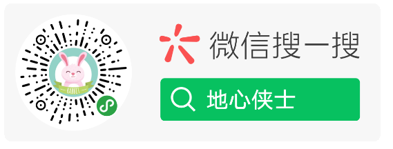
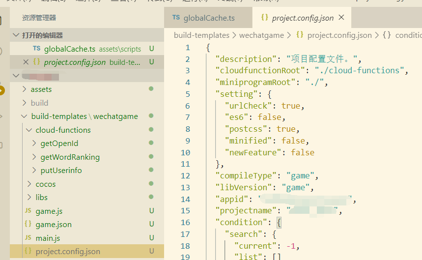
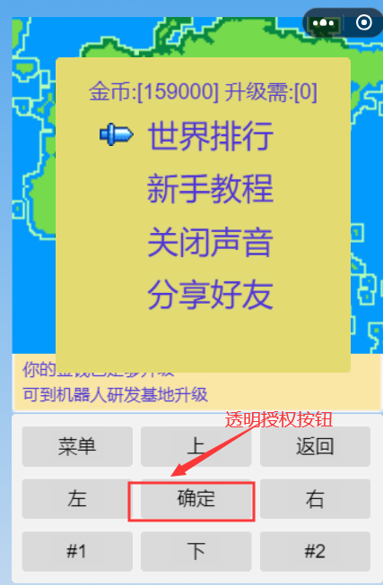
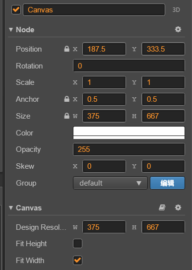
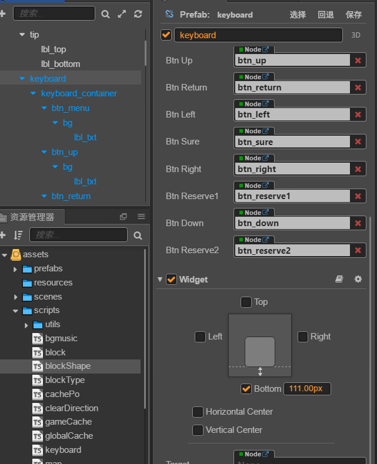
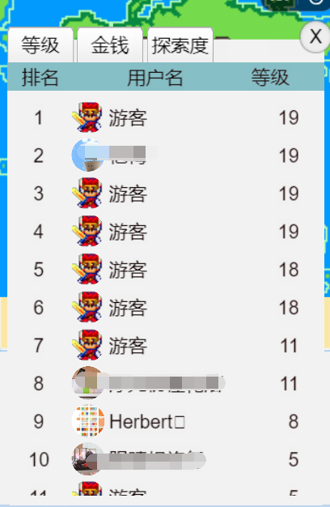

### CocosCreator实现微信排行榜

#### 1. 概述

不管是在现实生活还是当今游戏中，各式各样的排名层出不穷。如果我们做好一款游戏，却没有实现排行榜，一定是不完美的。排行榜不仅是玩家了解自己实力的途径，也是游戏运营刺激用户留存的一种途径。在微信小游戏中普遍存以下两种排名

+ 好友关系排名
+ 世界排名



其中好友的排名，需要通过微信子域实现。在子域上下文中，只能调用微信提供相关的api，且数据传输只能进不能出。即使在子域中调用云函数也不行。这个对数据很严格，开发略为复杂。但好处也很明显

+ 无需用户确认授权就可实现排名
+ 排名信息均为自己好友，刺激效果更明显

尽管这样，我们还是先实现世界排行。世界排行需要用户授权。早期只需要调用`wx.authorize`就可以实现，现在很不稳定(好像废弃了)。所以不得不通过生成一个授权按钮来实现

#### 2. 微信云开发

微信小游戏为开发者提供了一部分免费的云环境。可以实现文件存储，数据存储以及通过云函数实现服务端接口。开通方式也很简单，这里不做说明。既然要实现排名，优先选用云函数来实现对应的api。要实现云函数，需要在`project.config.json`文件中通过属性`cloudfunctionRoot`指定云函数目录。由于，是通过cocoscretor开发，每次构建发布都会清空输出内容。为了解决人肉复制粘贴，我们需要通过`定制小游戏构建模板`实现微信小游戏所有代码的管理。小游戏**地心侠士**构建模板如下



从图中，可以看到获取openid、获取世界排名、保存用户授权信息等云函数都放在cocoscreator代码环境中。这样在开发完成后，通过cocoscreator构建发布，对应的云函数也会一起打包过去

#### 3. 实现世界排行

##### 3.1 获取玩家openid

首先在构建模板的`cloud-functions`文件件中，使用`npm`初始一个名为`getOpenId`的node项目。初始好以后，运行`npm install wx-server-sdk@latest --save`。这样就建立好了一个云函数的基本框架。

我们在`index.js`文件，输入以下代码

```javascript
// author:herbert 464884492
// project:地心侠士  获取用户openid
const cloud = require('wx-server-sdk')
cloud.init()
exports.main = async (event, context) => {
  const wxContext = cloud.getWXContext()
  return {
    event,
    openid: wxContext.OPENID,
    appid: wxContext.APPID,
    unionid: wxContext.UNIONID,
  }
}
```
调用云函数时，上下文中便可以得到玩家openid和uninid。玩家进入游戏就先调用此函数，得到玩家的openid用于后边更新玩家数据和获取世界排行的条件。

小游戏端调用云函数前，需要初始云环境。因为采用定制构建模板，所以我们直接在模板的`game.js`文件末尾初始我的云环境

```javascript
// author:herbert 464884492
// 地心侠士 初始云环境
....
wxDownloader.init();
window.boot();

//初始化云调用
this.wx.cloud.init({
    traceUser: true,
    env: 'dxxs-dxxs'
});
...
```

后续调用云函数中，第一步都是要获取openid，这里定义一个全局变量将其保存起来，调用方法如下

```typescript
// author:herbert 464884492
// 地心侠士 玩家openid
private static openId: string = null;
private static initenv() {
  return new Promise((resolve, reject) => {
      if (!this.wx) reject();
      //直接使用本地缓存
      if (this.openId != null) resolve();
      // 调用云函数获取
      this.wx.cloud.callFunction({
          name: 'getOpenId',
          complete: res => {
              this.openId = res.result.openid;
              resolve();
          }
      });
  });
}
```

##### 3.2 动态生成授权按钮

先看下地心侠士布局界面



上图中可以看到，地心侠士虚拟了一个游戏操作区域。玩家聚焦到世界排行时，需要渲染一个授权按钮在确定的位置。需求很简单，可考虑到移动端多分辨率，这个操作就变得复杂了。需要做屏幕适配。地心侠士采用自适应宽度的适配策略，配置如下图



游戏运行时获取实际分辨率的宽度与设计的宽度相除，变可知道当前宽度变化比列，键盘容器九宫格使用了主键`widget`底部111px，高度161px。确定按钮宽度105px



微信小游戏以左上角为原点，通过`top`和`left`确定位置。然而，cocoscreator以左下角为原点，所以在计算`top`值时需要用屏幕宽度 - box上边缘y坐标。适配代码如下

```typescript
// author:herbert 464884492
// 地心侠士 动态生成透明授权按钮
 initUserInfoButton() {
  // 获取设计尺寸
  let desingSize: cc.Size = cc.view.getDesignResolutionSize();
  //  获取实际屏幕尺寸
  let screenSize: cc.Size = cc.view.getFrameSize();
  // 获取宽度倍率
  let widthRate = screenSize.width / desingSize.width;
  // 获取当前倍率下九宫格键盘实际高度
  let halfKcHeight = 161 * widthRate / 2;
  // 获取当前倍率下确定按钮实际宽度
  let btnwidth = this.btnKeySuer.width * widthRate;
  WxCloudFun.createUserinfoButton("", 
  // 确定按钮中心点对应小游戏left值 (屏幕宽度-确定按钮实际宽度）/2
  // 定义实际授权按钮size为105*40，所以还必须加上对应的偏差值
  // 以下代码中left体现整体适配过程，不考虑中间过程可以直接使用
  // (屏幕宽度-授权按钮)/2 即可得到left值
  screenSize.width / 2 - 52.5 * widthRate + (btnwidth - 105) / 2, 
  // Canvas 适配策略是 Fit Width,所以Canvas下边沿不一定就是屏幕边缘
  // 通过111*widthRate得到具体下沿值，在加上虚拟键盘一半高度，可得到中心位置
  // 由于微信原点在左上角，需要保持按钮处于中心位置，坐标还需要上移一半按钮高度
  screenSize.height - (111 * widthRate + halfKcHeight + 20),
 () => {
      this.keyCode = cc.macro.KEY.r;
      this.scheduleOnce(async () => {
          this.dlgRank.active = true;
          // 获取排名数据
          await this.getRankInfo();
      }, 0);
  });
}
```

##### 3.3 获取用户头像昵称信息

经过上一步骤的适配操作，只要玩家聚焦到【世界排行】，地心侠士虚拟键盘的确定按钮正上方会覆盖一个透明的`userInfoButton`,玩家点击确定就会唤起授权对话框，然后在对应的回调函数就可以完成用户数据保存操作

```typescript
// author:herbert 464884492
// 地心侠士 获取玩家基本信息
 public static createUserinfoButton(text: string, left: number, top: number, cb: Function) {
   this.userInfoButton = this.wx.createUserInfoButton({
      type: 'text',
      text: text,
      style: {
          left: left,
          top: top,
          height: 40,
          width: 105,
          lineHeight: 40,
          textAlign: 'center',
          fontSize: 16,
          backgroundColor: '#ff000000',// 透明
          color: '#ffffff',
      }
   });
   this.userInfoButton.hide();
   this.userInfoButton.onTap((res) => {
     // 将获取到的用户数据提交到云端
      this.wx.cloud.callFunction({
          name: 'putUserinfo',
          data: { ...res.userInfo, openid: this.openId }
      });
      this.hideUserInfoButton();
      cb.call();
   });
   }
```

在代码中，除了传入玩家微信信息外。我还额外传递进入游戏时就获取的`openid`。正常情况下不需要的，因为，云函数中天然会告诉你openid。不过，我们在后端使用了`got`获取玩家头像保存到云端文件存储中。引入此包后，后端就获取不到`openid`了，相当奇怪。对应云平台云函数代码如下

```typescript
// author:herbert 464884492
// 地心侠士 云函数保存玩家基本信息
const cloud = require('wx-server-sdk')
const got = require('got')
cloud.init()
// 云函数入口函数
exports.main = async(event, context) => {
  const {
    nickName,
    avatarUrl,
    gender,
    openid
  } = event;
  let wxContext = cloud.getWXContext();
  // 如果后端拿不到openid就采用前端传入的openid
  wxContext.OPENID = wxContext.OPENID || openid;
  const log = cloud.logger()
  log.info({
    tip: `正在请求头像地址[${avatarUrl}]`
  })
  // 获取头像数据流
  const stream = await got.stream(avatarUrl);
  let chunks = [];
  let size = 0;
  const body = await (async() => {
    return new Promise((res, reg) => {
      stream.on('data', chunk => {
        chunks.push(chunk)
        size += chunk.length
        log.info({
          tip: `正在读取图片流信息:[${chunk.length}]`
        })
      })
      stream.on('end', async() => {
        const body = Buffer.concat(chunks, size)
        log.info({
          tip: `正在保存头像文件:[${size}]`
        })
        res(body)
      })
    })
  })()
  //保存头像到云存储
  const {
    fileID
  } = await cloud.uploadFile({
    cloudPath: `avatars/${wxContext.OPENID}.jpg`,
    fileContent: body
  })
  // 添加或更新玩家信息到数据库
  const db = cloud.database()
  const {
    data
  } = await db.collection("dxxs").where({
    _openid: wxContext.OPENID
  }).get()
  const updateData = {
    fileId: fileID,
    nickName: nickName,
    sex: gender == 1 ? '男' : '女',
    avatarUrl: avatarUrl
  }
  if (data.length > 0) {
    log.info({
      tip: `正在修改数据库信息:[${size}]`
    })
    await db.collection("dxxs").doc(data[0]._id).update({
      data: updateData
    })
  } else {
    log.info({
      tip: `正在添加数据库信息:[${size}]`
    })
    await db.collection("dxxs").add({
      data: { ...updateData,
        _openid: openid
      }
    })
  }

  return {
    openid: wxContext.OPENID,
    appid: wxContext.APPID,
    unionid: wxContext.UNIONID
  }
}
```

##### 3.4 获取排行数据

保存完用户数据后，通过一个回调函数，实现了玩家排名数据获取。细心的朋友可以在前边授权按钮适配的章节看到`await this.getRankInfo();`这句代码。后端云函数就是一个简单数据查询。效果图如下



从上图可以看到，我实现了三个维度排名，需要在前端需要传入排名字段。对应代码如下

```typescript
// author:herbert 464884492
// 地心侠士 获取排名信息
 public static async getWorldRanking(field: string = "level") {
     const { result } = await this.wx.cloud.callFunction({
         name: 'getWordRanking',
         data: { order: field }
     });
     return result.ranks;
 }
 
```

云函数代码如下

```typescript
// author:herbert 464884492
// 地心侠士 云函数返回排名信息
const cloud = require('wx-server-sdk')
cloud.init()
exports.main = async (event, context) => {
  const wxContext = cloud.getWXContext()
  const db = cloud.database();
  const {
    order = "level"
  } = event;

  const openData = await db.collection("dxxs")
    .orderBy(order, "asc")
    .get()
  const ranks = openData.data.map(item => {
    return {
      openid: item._openid,
      [order]: item[order],
      nickName: item.nickName,
      fileId: item.fileId,
      avatarUrl: item.avatarUrl
    }
  });
  return {
    ranks: ranks,
    openid: wxContext.OPENID,
    appid: wxContext.APPID,
    unionid: wxContext.UNIONID
  }
}
```

#### 4. 总结

+ 微信子域数据很严格，数据只进不出。调用云函数也不行
+ 云函数中使用http请求，可能会得不到openid
+ 屏幕适配知道定位原则，也可以很简单
+ avatarUrl通过Sprite现实头像，需要设置安全域名
+ 目前部分华为手机分享截屏出现黑屏使用canvas.toTempFilePath就可以解决

这里有一个CoscosCreator游戏开发群，欢迎喜欢聊技术的朋友加入


欢迎感兴趣的朋友关注我的订阅号“小院不小”，或点击下方二维码关注。我将多年开发中遇到的难点，以及一些有意思的功能，体会都会一一发布到我的订阅号中


