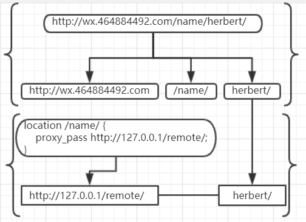
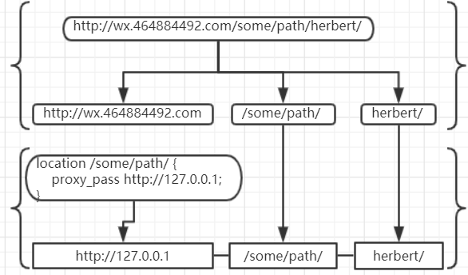

#### nginx中proxy_pass小斜杠

#### 1. 故事背景

相信做微信公众号开发的朋友都知道,要想在微信中预览效果,必须使用域名访问.很多朋友使用内网穿透工具.不仅不好用还不稳定.所以,发挥脸厚吃天下的态度,向公司it申请了一个子域名指向了阿里云一台ecs的80端口.可是后来,端口不够用了.本着就近原则,又找到IT小哥,能再好心的再映射一个8080端口.那知傲娇的小哥一脸鄙夷眼睛看着我,对不起子域名只能80端口.不凑巧的时,我的ecs也只开放了80端口.此时只有一个域名,我要映射多个服务器.是时候放出大器nginx了.诉求很简单

1. 访问 demo.herbert.com/dev1/json.do  映射内网地址 192.168.10.2:8080/dev1/json.do
2. 访问 demo.herbert.com/dev2/xxx.html 映射内网地址 192.168.10.2:8081/xxx.html

#### 2. 解决问题三部曲,文档搜索和测试

查看官方文档,我们选择 [tengine](http://tengine.taobao.org/nginx_docs/cn/docs/) 翻译的官方文档.在页面[模块参考目录]找到[ngx_http_proxy_module]链接,点击进入以后搜索proxy_pass.一定会找到以下两个说明

+ 如果proxy_pass使用了URI，当传送请求到后端服务器时，规范化以后的请求路径与配置中的路径的匹配部分将被替换为指令中定义的URI：

```nginx
location /name/ {
    proxy_pass http://127.0.0.1/remote/;
}
```

+ 如果proxy_pass没有使用URI，传送到后端服务器的请求URI一般客户端发起的原始URI，如果nginx改变了请求URI，则传送的URI是nginx改变以后完整的规范化URI：

```nginx
location /some/path/ {
    proxy_pass http://127.0.0.1;
}
```
这段说明晦涩难懂,还出现一个很多人搞不清楚的名称 **URI** ,当然我也是那个很多人,为此我搜索了**URI** **URL**的区别,期间还冒出了一个**URN**,头都大了,看了十分钟没找到满意的答案.姑且我么认为就是地址中的某一部分吧.

简单理解下第一点,如果 proxy_pass 配置值后边**包含/**,最终得到的路径,会去掉location配置的path,再结合请求地址中location配置之后可能存在的内容.两者相结合成一个新的地址.按照官方提供的配置.我们假设

+ 该nginx的访问域名是 `wx.464884492.com`
+ 用户访问的地址是 `wx.464884492/name/herbert/`

根据提供的第一种配置,nginx得到的真实地址示意图如下:



再简单理解下第二点,如果 proxy_pass 配置值后边**不包含/**,最终得到的路径,proxy_pass配置值加上location配置path以及之后的path.两者结合成一个新地址,按官方提供配置,我们假设

+ 该nginx的访问域名是 `wx.464884492.com`
+ 用户访问的地址是 `wx.464884492/some/path/herbert/`

根据提供的第二种配置,nginx得到的真实地址示意图如下:



所以简单总结就是 

+ 如果*proxy_pass*配置值 **包含 /** 就 **去掉** 匹配路径部分
+ 如果*proxy_pass*配置值 **不包含 /** 就 **保留** 匹配路径部分

#### 3. 结果验证

从nginx官网下载解压修改nginx.conf文件中http模块如下:

```nginx
...
http {
    include       mime.types;
    default_type  application/octet-stream;
    sendfile        on;
    keepalive_timeout  65;
    client_max_body_size   20M;
    server {
        listen       80 default_server;
        server_name  127.0.0.1;
        location / {  
            proxy_pass http://127.0.0.1;
        }
        location /name/  {
            proxy_pass http://127.0.0.1/remote/;
        }
        location /some/path/ {
           proxy_pass http://127.0.0.1;
        }
        error_page   500 502 503 504  /50x.html;
        location = /50x.html {
            root   html;
        }
    }
}
...

```
双击nginx.exe运行分别在浏览器中访问一下地址

+ http://127.0.0.1/name/herbert/
+ http://127.0.0.1/some/path/herbert/

由于我配置并没有具体root,访问页面最终的地址是找不到.所以页面会出现 An error occurred 的错误页.不过我们刚好可以在错误日志印证我们上面的结果.我们上边的示意图采用了域名的方式说明,如果想得到示意图上的结果,需要在host文件中添加配置`wx.464884492.com 127.0.0.1`同时在nginx配置文件server_name改成`wx.464884492.com`

打开logs目录下error.log日志文件,我们就会发现我们刚访问的信息以及最终转换的真实地址信息都乖乖的显示在那里,主要信息如下:

```plain
浏览器访问 http://127.0.0.1/name/herbert/
nginx 给我的访问日志
2019/12/06 14:21:32 [alert] 15384#12716: *9206 1024 worker_connections are not enough while connecting to upstream, 
client: 127.0.0.1, server: 127.0.0.1, 
request: "GET /remote/herbert/ HTTP/1.0", 
upstream: "http://127.0.0.1:80/remote/herbert/", host: "127.0.0.1"

浏览器访问 http://127.0.0.1/some/path/herbert/
nginx 给我的访问日志
2019/12/06 14:21:35 [alert] 15384#12716: *11251 1024 worker_connections are not enough while connecting to upstream, 
client: 127.0.0.1, server: 127.0.0.1, 
request: "GET /some/path/herbert/ HTTP/1.0", 
upstream: "http://127.0.0.1:80/some/path/herbert/", host: "127.0.0.1"

```
#### 4. 解决问题

有了以上知识我的诉求就完美解决了.
+ demo.herbert.com/dev1/json.do  映射内网地址 192.168.10.2:8080/dev1/json.do

对应配置

```nginx
location /dev1/ {  
 proxy_pass http://192.168.10.2:8080;
}
```

+ 访问 demo.herbert.com/dev2/xxx.html 映射内网地址 192.168.10.2:8081/xxx.html

对应配置

```nginx
location /dev2/ {  
 proxy_pass http://192.168.10.2:8081/;
}
```
#### 5. 总结

凡事多总结中没有坏处,以上那么多其实就一句话,**有杠去掉,无杠保留**,虽然小,但解决的步骤一个不少.

欢迎感兴趣的朋友关注我的微信订阅号"小院不小"，或者点击下方的二维码关注。我将多年开发中遇到的难点，以及一些有意思的功能，体会都会一一发布到我的订阅号中。需要**本文nginx配置文件**可以在公众号中回复**nginx1**


闲来无事，采用cocos creator开发了一个小游戏，感兴趣的朋友一个可以来玩玩


有喜欢聊技术朋友也欢迎入群，若二维码失效可加我微信回复**前端**

