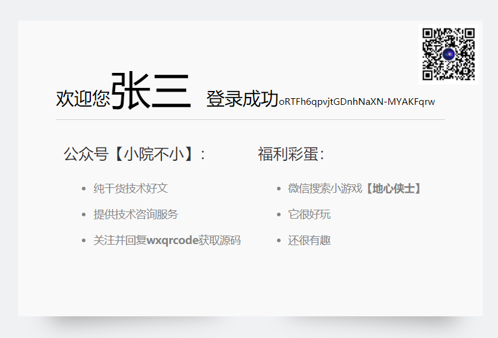

###  微信扫码登录

#### 1. 使用背景

如今开发业务系统，已不是一个单独的系统。往往需要同多个不同系统相互调用，甚至有时还需要跟微信，钉钉，飞书这样平台对接。目前我开发的部分业务系统，已经完成微信公众平台对接。作为知识总结，接下来，我们探讨下对接微信公众平台的一小部分功能，**微信扫码登录**。其中的关键点是获取**openid**。我仔细查找了微信提供的开发文档，主要有以下三个方式可实现。

1. 通过微信公众平台生成带参数的二维
2. 通过微信公众平台微信网页授权登录
3. 通过微信开发平台微信登录功能

#### 2. 开发环境搭建

##### 2.1 内网穿透

微信所有的接口访问，都要求使用域名。但多数开发者是没有域名，给很多开发者测试带来了麻烦。不过有以下两种方案可以尝试：

1. 使用公司域名，让公司管理员配置一个子域名指向你公司公网的一个ip的80端口。然后通过Nginx或者通过nat命令，将改域名定位到您的开发环境
2. 使用内网穿透工具，目前市面有很多都可以使用免费的隧道。不过就是不稳定，不支持指定固定子域名或者已经被微信限制访问。经过我大量收集资料，发现**钉钉开发平台**提供的内网穿透工具，比较不错。用阿里的东西来对接微信东西，想想都为微信感到耻辱。你微信不为开发者提供便利，就让对手来实现。

那钉钉的内网穿透工具具体怎么使用用的呢？

首先使用git下载[钉钉内网穿透工具](https://github.com/open-dingtalk/pierced)，下载好后找到`windows_64`目录，在这里新建一个`start.bat`文件，内容为

```bash
ding -config=ding.cfg -subdomain=pro 8080
```
其中`-subdomain` 是用来生成子域名`8080`表示隐射本地8080端口
双击`start.bat`文件，最终启动成功界面如下


经过我测试，这个相当稳定，并且可以指定静态子域名。简直就是业界良心

##### 2.2 公众号测试环境

访问[公众平台测试账号系统](https://mp.weixin.qq.com/debug/cgi-bin/sandboxinfo?action=showinfo&t=sandbox/index)，可以通过微信登录，可快速得到一个测试账号。然后我们需要以下两个配置

* 接口配置信息


在点击**提交**按钮时，微信服务器会验证我们配置的这个URL是否有效。这个URL有两个用途

1. 通过签名验证地址是否有效
2. 接收微信推送的信息，比如用户扫码后通知

签名生成逻辑是用配置的`token`结合微信回传的`timestamp`,`nonce`，通过字符串数组排序形成新的字符串，做**SHA**签名，再将签名后的二进制数组转换成十六进制字符串。最终的内容就是具体的签名信息。对应的java代码如下

```java
// author: herbert 公众号：小院不小 20210424
	public static String getSignature(String token, String timestamp, String nonce) {
		String[] array = new String[] { token, timestamp, nonce };
		Arrays.sort(array);
		StringBuffer sb = new StringBuffer();
		for (String str : array) {
			sb.append(str);
		}
		try {
			MessageDigest md = MessageDigest.getInstance("SHA-1");
			md.update(sb.toString().getBytes());
			byte[] digest = md.digest();
			StringBuffer hexStr = new StringBuffer();
			String shaHex = "";
			for (int i = 0; i < digest.length; i++) {
				shaHex = Integer.toHexString(digest[i] & 0xFF);
				if (shaHex.length() < 2) {
					hexStr.append(0);
				}
				hexStr.append(shaHex);
			}
			return hexStr.toString();

		} catch (NoSuchAlgorithmException e) {
			logger.error("获取签名信息失败", e.getCause());
		}
		return "";
	}
```

对应GET请求代码如下

```java
// author: herbert 公众号：小院不小 20210424
	protected void doGet(HttpServletRequest request, HttpServletResponse response)
			throws ServletException, IOException {
		logger.info("微信在配置服务器传递验证参数");
		Map<String, String[]> reqParam = request.getParameterMap();
		for (String key : reqParam.keySet()) {
			logger.info(" {} = {}", key, reqParam.get(key));
		}

		String signature = request.getParameter("signature");
		String echostr = request.getParameter("echostr");
		String timestamp = request.getParameter("timestamp");
		String nonce = request.getParameter("nonce");

		String buildSign = WeixinUtils.getSignature(TOKEN, timestamp, nonce);

		logger.info("服务器生成签名信息:{}", buildSign);
		if (buildSign.equals(signature)) {
			response.getWriter().write(echostr);
			logger.info("服务生成签名与微信服务器生成签名相等，验证成功");
			return;
		}
	}
```
微信服务器验证规则是原样返回`echostr`,如果觉得签名麻烦，直接返回`echostr`也是可以的。

* JS接口安全域名


这个配置主要用途是解决H5与微信JSSDK集成。微信必须要求指定的域名下，才能调用JSSDK

#### 3. 测试项目搭建

为了测试扫码登录效果，我们需要搭建一个简单的maven工程。工程中具体文件目录如下


用户扫描二维码得到对应的`openid`，然后在`userdata.json`文件中，根据`openid`查找对应的用户。找到了，就把用户信息写入缓存。没找到，就提醒用户绑定业务账号信息。前端通过定时轮询，从服务缓存中查找对应扫码的用户信息

`userdata.json`文件中的内容如下

```json
[{
	"userName": "张三",
	"password":"1234",
	"userId": "000001",
	"note": "扫码登录",
	"openId": ""
}]
```
从代码可以知道，后端提供了5个Servlet，其作用分别是

1. WeixinMsgEventServlet 完成微信服务器验证，接收微信推送消息。
2. WeixinQrCodeServlet 完成带参数二维码生成，以及完成登录轮询接口
3. WeixinBindServlet 完成业务信息与用户openid绑定操作
4. WeixinWebQrCodeServlet 完成网页授权登录的二维码生成
5. WeixinRedirectServlet 完成网页授权接收微信重定向回传参数

需要调用微信接口信息如下

```java
  // author: herbert 公众号小院不小 20210424
	private static final String ACCESS_TOKEN_URL = "https://api.weixin.qq.com/cgi-bin/token?grant_type=client_credential&appid={0}&secret={1}";
	private static final String QRCODE_TICKET_URL = "https://api.weixin.qq.com/cgi-bin/qrcode/create?access_token={0}";
	private static final String QRCODE_SRC_URL = "https://mp.weixin.qq.com/cgi-bin/showqrcode?ticket={0}";
	private static final String STENDTEMPLATE_URL = "https://api.weixin.qq.com/cgi-bin/message/template/send?access_token={0}";
	private static final String WEB_AUTH_URL = "https://open.weixin.qq.com/connect/oauth2/authorize?appid={0}&redirect_uri={1}&response_type=code&scope=snsapi_base&state={2}#wechat_redirect";
	private static final String WEB_AUTH_TOKEN_URL = "https://api.weixin.qq.com/sns/oauth2/access_token?appid={0}&secret={1}&code={2}&grant_type=authorization_code";
```

前端对应的三个页面分别是

1. login.html 用于展现登录的二维码,以及实现轮询逻辑
2. index.html 用于登录成功后，显示用户信息
3. weixinbind.html 用于用户绑定业务信息

最终实现的效果如下


已绑定openid直接跳转到首页



未绑定用户，在手机到会收到邀请微信绑定链接


#### 4. 带参数二维码登录

生成带参数的二维码主要通过以下**三**个步骤来实现

1. 使用APPID和APPSECRET换取ACCESSTOKEN
2. 使用ACCESSTOKEN换取对应二维码的TICKET
3. 使用TICKET获取具体的二维图片返回给前端

##### 4.1 获取公众号ACCESSTOKEN

换取ACCESSTOKEN 代码如下

```java
// author: herbert 公众号小院不小 20210424
public static String getAccessToken() {
		if (ACCESSTOKEN != null) {
			logger.info("从内存中获取到AccessToken:{}", ACCESSTOKEN);
			return ACCESSTOKEN;
		}
		String access_token_url = MessageFormat.format(ACCESS_TOKEN_URL, APPID, APPSECRET);
		logger.info("access_token_url转换后的访问地址");
		logger.info(access_token_url);
		Request request = new Request.Builder().url(access_token_url).build();
		OkHttpClient httpClient = new OkHttpClient();
		Call call = httpClient.newCall(request);
		try {
			Response response = call.execute();
			String resBody = response.body().string();
			logger.info("获取到相应正文:{}", resBody);
			JSONObject jo = JSONObject.parseObject(resBody);
			String accessToken = jo.getString("access_token");
			String errCode = jo.getString("errcode");
			if (StringUtils.isBlank(errCode)) {
				errCode = "0";
			}
			if ("0".equals(errCode)) {
				logger.info("获取accessToken成功,值为：{}", accessToken);
				ACCESSTOKEN = accessToken;
			}

			return accessToken;
		} catch (IOException e) {
			logger.error("获取accessToken出现错误", e.getCause());
		}
		return null;
	}

```

##### 4.2  获取二维码TICKET

根据ACCESSTOKEN获取二维码TICKET代码如下

```java
// author: herbert 公众号：小院不小 20210424
public static String getQrCodeTiket(String accessToken, String qeCodeType, String qrCodeValue) {
		String qrcode_ticket_url = MessageFormat.format(QRCODE_TICKET_URL, accessToken);
		logger.info("qrcode_ticket_url转换后的访问地址");
		logger.info(qrcode_ticket_url);

		JSONObject pd = new JSONObject();
		pd.put("expire_seconds", 604800);
		pd.put("action_name", "QR_STR_SCENE");
		JSONObject sence = new JSONObject();
		sence.put("scene", JSONObject
				.parseObject("{\"scene_str\":\"" + MessageFormat.format("{0}#{1}", qeCodeType, qrCodeValue) + "\"}"));
		pd.put("action_info", sence);
		logger.info("提交内容{}", pd.toJSONString());
		RequestBody body = RequestBody.create(JSON, pd.toJSONString());

		Request request = new Request.Builder().url(qrcode_ticket_url).post(body).build();
		OkHttpClient httpClient = new OkHttpClient();
		Call call = httpClient.newCall(request);
		try {
			Response response = call.execute();
			String resBody = response.body().string();
			logger.info("获取到相应正文:{}", resBody);
			JSONObject jo = JSONObject.parseObject(resBody);
			String qrTicket = jo.getString("ticket");
			String errCode = jo.getString("errcode");
			if (StringUtils.isBlank(errCode)) {
				errCode = "0";
			}
			if ("0".equals(jo.getString(errCode))) {
				logger.info("获取QrCodeTicket成功,值为：{}", qrTicket);
			}
			return qrTicket;
		} catch (IOException e) {
			logger.error("获取QrCodeTicket出现错误", e.getCause());
		}
		return null;
	}

```
##### 4.3  返回二维图片

获取二维码图片流代码如下

```java
// author: herbert 公众号：小院不小 20210424
public static InputStream getQrCodeStream(String qrCodeTicket) {
		String qrcode_src_url = MessageFormat.format(QRCODE_SRC_URL, qrCodeTicket);
		logger.info("qrcode_src_url转换后的访问地址");
		logger.info(qrcode_src_url);
		Request request = new Request.Builder().url(qrcode_src_url).get().build();
		OkHttpClient httpClient = new OkHttpClient();
		Call call = httpClient.newCall(request);
		try {
			Response response = call.execute();
			return response.body().byteStream();
		} catch (IOException e) {
			logger.error("获取qrcode_src_url出现错误", e.getCause());
		}
		return null;
	}
```

最终二维码图片通过`servlet`中的**get**方法返回到前端，需要注意的地方就是为当前session添加**key**用于存储扫码用户信息或`openid`

```java
// author: herbert 公众号：小院不小 20210424
protected void doGet(HttpServletRequest request, HttpServletResponse response)
			throws ServletException, IOException {
    accessToken = WeixinUtils.getAccessToken();
		String cacheKey = request.getParameter("key");
		logger.info("当前用户缓存key:{}", cacheKey);
		WeixinCache.put(cacheKey, "none");
		WeixinCache.put(cacheKey + "_done", false);
		if (qrCodeTicket == null) {
			qrCodeTicket = WeixinUtils.getQrCodeTiket(accessToken, QRCODETYPE, cacheKey);
		}
		InputStream in = WeixinUtils.getQrCodeStream(qrCodeTicket);
		response.setContentType("image/jpeg; charset=utf-8");
		OutputStream os = null;
		os = response.getOutputStream();
		byte[] buffer = new byte[1024];
		int len = 0;
		while ((len = in.read(buffer)) != -1) {
			os.write(buffer, 0, len);
		}
		os.flush();
	}
```
##### 4.4  前端显示二维图片

前端可以使用`image`标签，`src`指向这个`servlet`地址就可以了

```html
<div class="loginPanel" style="margin-left: 25%;">
    <div class="title">微信登录(微信场景二维码)</div>
    <div class="panelContent">
      <div class="wrp_code"></div>
      <div class="info">
        <div id="wx_default_tip">
          <p>请使用微信扫描二维码登录</p>
          <p>“扫码登录测试系统”</p>
        </div>
      </div>
    </div>
  </div>
```

##### 4.5  前端轮询扫码情况

pc端访问`login`页面时，除了显示对应的二维码，也需要开启定时轮询操作。查询到扫码用户信息就跳转到`index`页面，没有就间隔2秒继续查询。轮询的代码如下

```javascript
// author: herbert 公众号：小院不小 20210424
  function doPolling() {
      fetch("/weixin-server/weixinqrcode?key=herbert_test_key", { method: 'POST' }).then(resp => resp.json()).then(data => {
        if (data.errcode == 0) {
          console.log("获取到绑定用户信息")
          console.log(data.binduser)
          localStorage.setItem("loginuser", JSON.stringify(data.binduser));
          window.location.replace("index.html")
        }
        setTimeout(() => {
          doPolling()
        }, 2000);
      })
    }
    doPolling()
```
可以看到前端访问了后台一个**POST**接口，这个对应的后台代码如下

```java
// author: herbert 公众号：小院不小 20210424
	protected void doPost(HttpServletRequest request, HttpServletResponse response)
			throws ServletException, IOException {
		String cacheKey = request.getParameter("key");
		logger.info("登录轮询读取缓存key:{}", cacheKey);
		Boolean cacheDone = (Boolean) WeixinCache.get(cacheKey + "_done");
		response.setContentType("application/json;charset=utf-8");
		String rquestBody = WeixinUtils.InPutstream2String(request.getInputStream(), charSet);
		logger.info("获取到请求正文");
		logger.info(rquestBody);
		logger.info("是否扫码成功:{}", cacheDone);
		JSONObject ret = new JSONObject();
		if (cacheDone != null && cacheDone) {
			JSONObject bindUser = (JSONObject) WeixinCache.get(cacheKey);
			ret.put("binduser", bindUser);
			ret.put("errcode", 0);
			ret.put("errmsg", "ok");
			WeixinCache.remove(cacheKey);
			WeixinCache.remove(cacheKey + "_done");
			logger.info("已移除缓存数据，key：{}", cacheKey);
			response.getWriter().write(ret.toJSONString());
			return;
		}
		ret.put("errcode", 99);
		ret.put("errmsg", "用户还未扫码");
		response.getWriter().write(ret.toJSONString());
	}

```
通过以上的操作，完美解决了二维显示和轮询功能。但用户扫描了我们提供二维码，我们系统怎么知道呢？还记得我们最初配置的URL么，微信会把扫描情况通过**POST**的方式发送给我们。对应接收的POST代码如下

```java
// author: herbert 公众号：小院不小 20210424
protected void doPost(HttpServletRequest request, HttpServletResponse response)
			throws ServletException, IOException {
		String rquestBody = WeixinUtils.InPutstream2String(request.getInputStream(), charSet);
		logger.info("获取到微信推送消息正文");
		logger.info(rquestBody);
		try {
			DocumentBuilderFactory dbf = DocumentBuilderFactory.newInstance();
			dbf.setFeature("http://apache.org/xml/features/disallow-doctype-decl", true);
			dbf.setFeature("http://xml.org/sax/features/external-general-entities", false);
			dbf.setFeature("http://xml.org/sax/features/external-parameter-entities", false);
			dbf.setFeature("http://apache.org/xml/features/nonvalidating/load-external-dtd", false);
			dbf.setXIncludeAware(false);
			dbf.setExpandEntityReferences(false);
			DocumentBuilder db = dbf.newDocumentBuilder();
			StringReader sr = new StringReader(rquestBody);
			InputSource is = new InputSource(sr);
			Document document = db.parse(is);
			Element root = document.getDocumentElement();
			NodeList fromUserName = document.getElementsByTagName("FromUserName");
			String openId = fromUserName.item(0).getTextContent();
			logger.info("获取到扫码用户openid:{}", openId);
			NodeList msgType = root.getElementsByTagName("MsgType");
			String msgTypeStr = msgType.item(0).getTextContent();
			if ("event".equals(msgTypeStr)) {
				NodeList event = root.getElementsByTagName("Event");
				String eventStr = event.item(0).getTextContent();
				logger.info("获取到event类型:{}", eventStr);
				if ("SCAN".equals(eventStr)) {
					NodeList eventKey = root.getElementsByTagName("EventKey");
					String eventKeyStr = eventKey.item(0).getTextContent();
					logger.info("获取到扫码场景值:{}", eventKeyStr);

					if (eventKeyStr.indexOf("QRCODE_LOGIN") == 0) {
						String cacheKey = eventKeyStr.split("#")[1];
						scanLogin(openId, cacheKey);
					}
				}
			}
			if ("text".equals(msgTypeStr)) {
				NodeList content = root.getElementsByTagName("Content");
				String contentStr = content.item(0).getTextContent();
				logger.info("用户发送信息:{}", contentStr);
			}
		} catch (Exception e) {
			logger.error("微信调用服务后台出现错误", e.getCause());
		}
	}
```

我们需要的扫码数据是 `MsgType=="event" and Event=="SCAN" `,找到这条数据，解析出我们在生成二维码时传递的`key`值，再写入缓存即可。代码中的 `scanLogin(openId, cacheKey)`完成具体业务逻辑，如果用户已经绑定业务账号，则直接发送模板消息**登录成功**，否则发送模板消息**邀请微信绑定**，对应的代码逻辑如下

```java
// author: herbert 公众号：小院不小 20210424
private void scanLogin(String openId, String cacheKey) throws IOException {
   JSONObject user = findUserByOpenId(openId);
   if (user == null) {
   // 发送消息让用户绑定账号
   logger.info("用户还未绑定微信，正在发送邀请绑定微信消息");
   WeixinUtils.sendTempalteMsg(WeixinUtils.getAccessToken(), openId,
   		"LWP44mgp0rEGlb0pK6foatU0Q1tWhi5ELiAjsnwEZF4",
   		"http://pro.vaiwan.com/weixin-server/weixinbind.html?key=" + cacheKey, null);
   WeixinCache.put(cacheKey, openId);
   return;
   }
   // 更新缓存
   WeixinCache.put(cacheKey, user);
   WeixinCache.put(cacheKey + "_done", true);
   logger.info("已将缓存标志[key]:{}设置为true", cacheKey + "_done");
   logger.info("已更新缓存[key]:{}", cacheKey);
   logger.info("已发送登录成功微信消息");
   WeixinUtils.sendTempalteMsg(WeixinUtils.getAccessToken(), openId, "MpiOChWEygaviWsIB9dUJLFGXqsPvAAT2U5LcIZEf_o",
   	null, null);
}
```
以上就完成了通过场景二维实现微信登录的逻辑

#### 5. 网页授权登录

网页授权登录的二维码需要我们构建好具体的内容，然后使用二维码代码库生成二维码

##### 5.1 生成网页授权二维码

```java
// author: herbert 公众号：小院不小 20210424
	protected void doGet(HttpServletRequest request, HttpServletResponse response)
			throws ServletException, IOException {
	  String cacheKey = request.getParameter("key");
		logger.info("当前用户缓存key:{}", cacheKey);
		BufferedImage bImg = WeixinUtils.buildWebAuthUrlQrCode("http://pro.vaiwan.com/weixin-server/weixinredirect",
				cacheKey);
		if (bImg != null) {
			response.setContentType("image/png; charset=utf-8");
			OutputStream os = null;
			os = response.getOutputStream();
			ImageIO.write(bImg, "png", os);
			os.flush();
		}
	}
```

可以看到，我们这里缓存`key`值，通过`state`方式传递给微信服务器。微信服务器会将该值原样返回给我我们的跳转地址，并且附带上授权码。我们通过二维码库生成二维码，然后直接返回二维码图。前端直接指向这个地址就可显示图片了。对应前端代码如下

```html
  <div class="loginPanel">
    <div class="title">微信登录(微信网页授权)</div>
    <div class="panelContent">
      <div class="wrp_code"></div>
      <div class="info">
        <div id="wx_default_tip">
          <p>请使用微信扫描二维码登录</p>
          <p>“扫码登录测试系统”</p>
        </div>
      </div>
    </div>
  </div>
```

##### 5.2 获取openid并验证

用户扫描我们生成的二维码以后，微信服务器会发送一个**GET**请求到我们配置的跳转地址，我们在这里完成`openid`的验证和业务系统用户信息获取操作，对应代码如下

```java
// author: herbert 公众号：小院不小 20210424
	protected void doGet(HttpServletRequest request, HttpServletResponse response)
			throws ServletException, IOException {
		String code = request.getParameter("code");
		String state = request.getParameter("state");
		logger.info("获取到微信回传参数code:{},state:{}", code, state);
		JSONObject webTokenInfo = WeixinUtils.getWebAuthTokenInfo(code);
		if (webTokenInfo != null && !webTokenInfo.containsKey("errcode")) {
			String openId = webTokenInfo.getString("openid");
			logger.info("获取到用opeind", openId);
			JSONObject user = findUserByOpenId(openId);
			if (user == null) {
				//用户未绑定 将openid存入缓存方便下一步绑定用户
				WeixinCache.put(state, openId);
				response.sendRedirect("weixinbind.html?key=" + state);
				return;
			}
			WeixinCache.put(state, user);
			WeixinCache.put(state + "_done", true);
			logger.info("已将缓存标志[key]:{}设置为true", state + "_done");
			logger.info("已更新缓存[key]:{}", state);

			response.setCharacterEncoding("GBK");
			response.getWriter().print("扫码成功，已成功登录系统");
		}
	}
```
用户扫描这个二维码后，逻辑跟场景二维码一样，找到用户信息就提示用户已成功登陆系统，否则就跳转到微信绑定页面

#### 6. 开发平台登录

开放平台登录需要认证过后才能测试，认证需要交钱。对不起，我不配测试。

#### 7. 总结

扫描登录主要逻辑是生成带key值二维，然后一直轮询服务器查询登录状态。以上两个方式各有优劣，主要区别如下

1. 带参数二维码方式，微信负责生成二维。网页授权需要我们自己生成二维
2. 带参数二维扫码成功或邀请绑定采用模板消息推送，网页授权可以直接跳转，体验更好
3. 带参数二维码用途更多，比如像ngork.cc网站，实现关注了公众号才能加隧道功能

这里涉及到的知识点有

1. Oauth认证流程
2. 二维码生成逻辑
3. 内网穿透原理
4. Javaservlet开发

开发过程中，需要多查帮助文档。开发过程中的各种环境配置，对开发者来说，也是不小的挑战。做微信开发也有好多年，从企业微信，到公众号，到小程序，到小游戏，一直没有总结。这次专门做了一个微信扫码登录专题。先写代码，再写总结也花费了数周时间。如果觉得好，还望关注公众号支持下，您的**点赞**和**在看**是我写作力量的源泉。对微信集成和企业微信集成方面有问题的，也欢迎在公众号回复，我看到了会第一时间力所能及的为您解答。需要文中提及的项目，请扫描下方的二维码,关注公众号[**小院不小**],回复**wxqrcode**获取.

