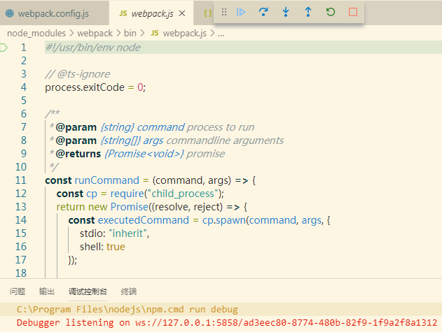
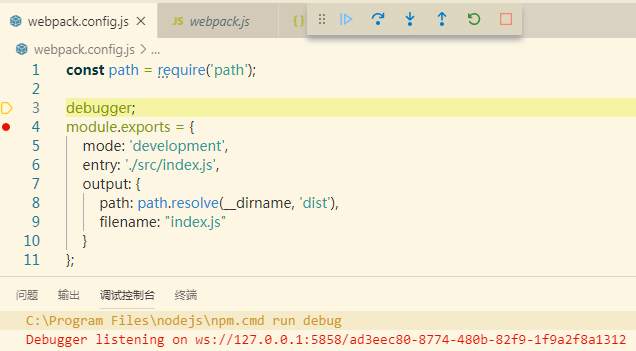
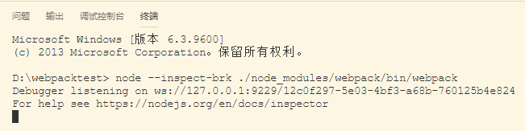
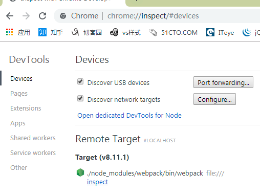
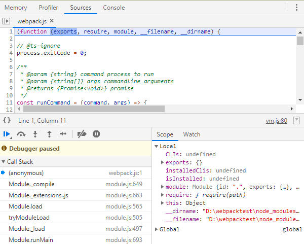
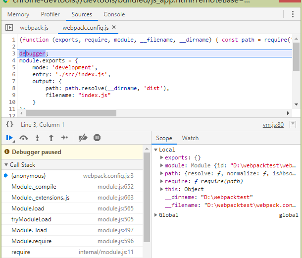

### 调试webpack

#### 1. 摘要

用过构建工具webpack的朋友应该都体会，面对其几百行的配置内容如大海一小舟，找不到边。看文档查百度，对其构建的生命周期看了又看。最终还是很茫然。原因很简单，构建配置一般都是通过脚手架工具自动生成。看似每天在用，其实接触很少。直到有一天，发现社区的插件不能满足需求时，相信你一定会定制一个自己的插件。这时你需要彻底了解它的机制，作为开发，调试代码一定是了解内部逻辑最好的方法。

不管是 npm 还是 webpack 都是基于nodejs的工具。所以最终是调试node。这里我介绍三种调试的方法。需要提前准备好以下工具

* vscode
* google chrome

使用npm初始一个项目命名为webpacktest。需要源码的朋友可关注公众号**小院不小**,回复 **webpackdebug**。安装项目依赖

```bash
npm i -D webpack webpack-cli
```

添加webpack配置文件,并在其中使用`debugger`设置一个断点。

```js

const path = require('path');
debugger;
module.exports = {
    mode: 'development',
    entry: './src/index.js',
    output: {
        path: path.resolve(__dirname, 'dist'),
        filename: "index.js"
    }
};
```

#### 2. (方法一)使用vscode运行npm调试

在新建项目的package.json文件`scripts`项中添加一个key为debug的配置，内容如下

```json
...
 "scripts": {
    "build": "webpack",
    "debug": "node --inspect-brk=5858 ./node_modules/webpack/bin/webpack"
  }
...
```

vscode中选择调页签，在左上角调试的下拉框中选择添加配置，选择Node环境。vscode会自动生成一个 launch.json 文件，将文件的内容调整为以下内容

```json
{
    "version": "0.2.0",
    "configurations": [
        {
            "type": "node",
            "request": "launch",
            "name": "build",
            "stopOnEntry": true,
            "runtimeExecutable": "npm",
            "runtimeArgs": [
                "run",
                "debug"
            ],
            "port": 5858
        }
    ]
}
```
其中端口配置需要和inspect-brk配置的端口保持一致。`stopOnEntry`表示在运行的第一行代码中添加断点,点击开始调试按钮，即可进入如下界面



继续点击运行，即可进入配置文件设置的断点



其中左边的小红点是，直接在vscode中添加的断点。此断点也可中断。

#### 3. (方法二)使用vscode运行node调试

我们细看在package.js文件中配置的调试脚本，其实是运行node，所以就想是否可以不通过npm直接运行。经过测试，确实是可以的。回到我们launch.json文件，将配置文件改为如下

```json
{
    "version": "0.2.0",
    "configurations": [
        {
            "type": "node",
            "request": "launch",
            "name": "Node",
            "stopOnEntry": true,
            "program": "${workspaceFolder}/node_modules/webpack/bin/webpack"
        }
    ]
}
```
点击开始调试, 依然可得到方法一中一样的调试结果。通过这种方式，没有package.json文件的约束。更简单也减少了错误的几率。

#### 4. (方法三)命令行结合Chrome调试

在命令行中输入命令 `node --inspect-brk ./node_modules/webpack/bin/webpack`，为了方便，我们这还是使用vscode，运行效果如下



打开chrome浏览器，在地址栏输入 chrome://inspect/#devices,在界面中点击inspect,此时熟悉的界面就出来了，和平时调试前端一样。显示如下



点击后，便可进入断点，如下



在点击下调试按钮，可进入我们在配置文件中设置的断点



#### 5. 总结

在以前就配置过调试webpack,时间久了就忘了，这次突然有需求了又查了好久资料。想想了想，还是总结分享出来。做开发，每天接触的多，还是要多写。
若仔细看文章的朋友，所谓三个方法都是围绕命令 `node --inspect-brk ./node_modules/webpack/bin/webpack` .我在查询资料时，最初得到的命令是 `node --inspect-brk ./node_modules/.bin/webpack`,这命令会出现错误。

欢迎感兴趣的朋友关注我的微信订阅号"小院不小"，或者点击下方的二维码关注。我将多年开发中遇到的难点，以及一些有意思的功能，体会都会一一发布到我的订阅号中。需要**本文demo**可以在公众号中回复**webpackdebug**


闲来无事，采用cocos creator开发了一个小游戏，感兴趣的朋友一个可以来玩玩


有喜欢聊技术朋友也欢迎入群，若二维码失效可加我微信回复**前端**

